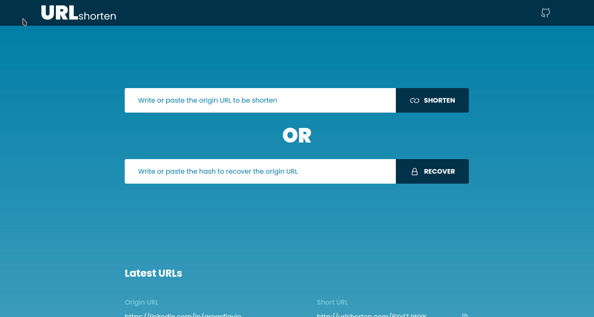

  

  A url shortener application build with ViteJS, ReactJs, CSS Modules and Typescript.

  Checkout the <a href="https://url-shortener-web-liard.vercel.app">Live version</a>

 

## 💻 Demo

 

## ⌨️ Tech

This is what i used and learned with this project:

- [x] ViteJS
- [x] ReactJS
- [x] CSS Modules
- [x] ClipboardJS
- [x] Typescript

 

## 👨🏻‍💻 Author

Build by Flávio Arêas 👋 [Get in touch!](https://www.linkedin.com/in/areasflavio/)
